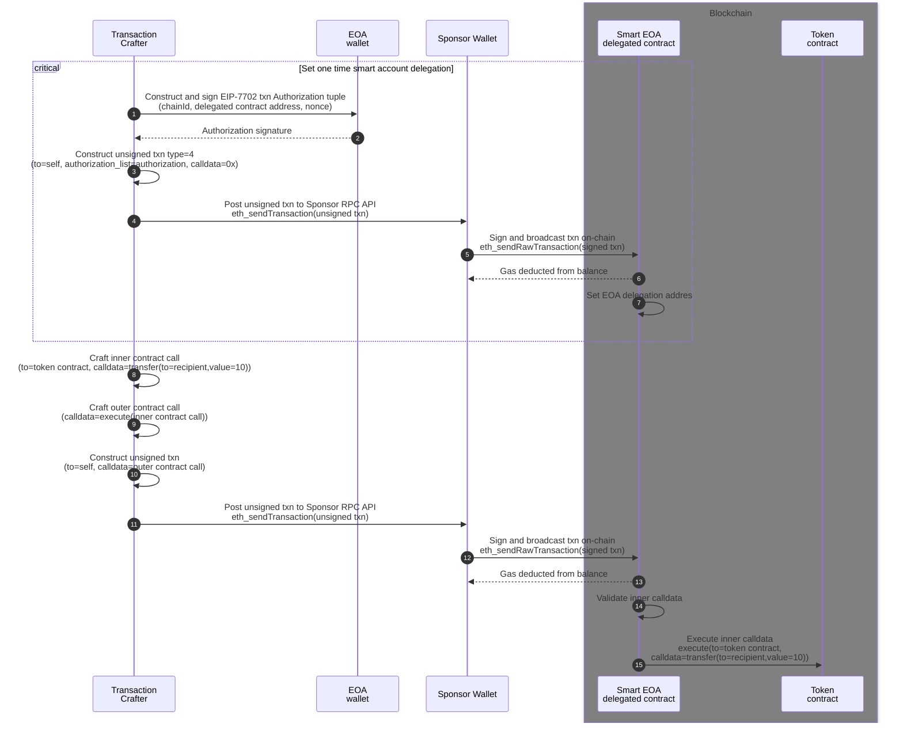

# EIP-7702 transaction sponsoring
- EOA account transacts with 0 ETH
- Sponsor EOA account funds transactions
- includes basic Smart EOA delegated contract
- includes ERC20 token contract bytecode which is deployed by Smart EOA




### Launch Gas Sponsor RPC node
```shell
npm install --prefix ./sponsor-api
ts-node sponsor-api/sponsor.ts
```

### Execute transaction cases from EOA wallet
```shell
npm install --prefix ./viem-client
NODE_ENV=development ts-node viem-client/src/index.ts
```