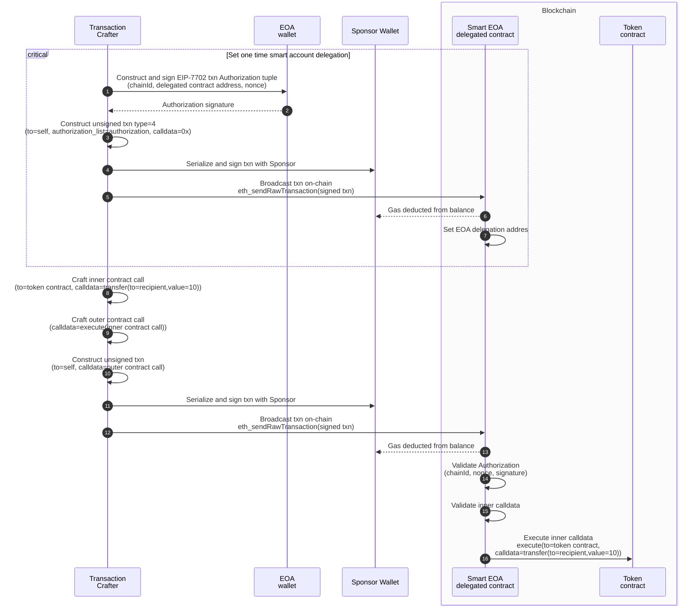

# EIP-7702 transaction sponsoring
- EOA account transacts with 0 ETH
- Sponsor EOA account funds transactions
- includes basic Smart EOA delegated contract
- includes ERC20 token contract bytecode which is deployed by Smart EOA




### Launch prague (Pectra) with EIP-7702 support
```shell
anvil --hardfork prague
```

### Deploy Smart EOA contract
```shell
forge create --private-key 0xac0974bec39a17e36ba4a6b4d238ff944bacb478cbed5efcae784d7bf4f2ff80 \
    --broadcast src/BatchCallDelegation.sol:BatchCallDelegation
```

### Fund EOA Wallet (0 ETH) and Gas Sponsor EOA (10 ETH)
```shell
cast rpc anvil_setBalance 0xa0Ee7A142d267C1f36714E4a8F75612F20a79720 0
cast rpc anvil_setBalance 0x70997970C51812dc3A010C7d01b50e0d17dc79C8 10000000000000000000
```

### Execute the transaction cases
```shell
NODE_ENV=development ts-node viem-client/src/index.ts
```